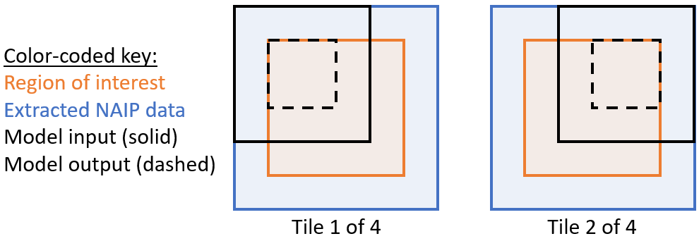
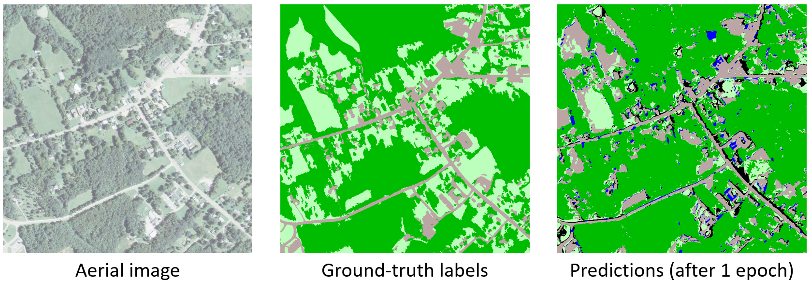

# Apply the trained model to new data

We will apply the trained model to an approximately 1 km x 1 km region centered at a point in Charlotte County, VA. This region is close to (but does not overlap with) the regions used to train the model; since the land type is very similar, we expect reasonable performance despite the short training time and limited training dataset.

## Submit the evaluation job

We will launch an evaluation job to apply our trained model to a specified region in our evaluation data. Before executing the command below, ensure that the `evaluation_job.json` file contained in this git repository has been downloaded to your computer and is available on the path, and that the training job has finished running.
```
az batchai job create -n evaluationjob -f evaluation_job.json -c batchaidemo --resource-group %AZURE_RESOURCE_GROUP% -w %WORKSPACE_NAME% -e %EXPERIMENT_NAME%
```
This job will take ~5 minutes to run; while waiting, you can read the section below for more information on what the job is doing. You can check on the job's progress using the following command:
```
az batchai job show -n evaluationjob --resource-group %AZURE_RESOURCE_GROUP% -w %WORKSPACE_NAME% -e %EXPERIMENT_NAME%
```

When the job status indicated by the "executionState" changes to "succeeded", the evaluation job is complete. You can also monitor the standard output and error messages as they're produced using the following commands:
```
az batchai job file stream -d stdouterr -j evaluationjob -f stdout.txt -g %AZURE_RESOURCE_GROUP% -w %WORKSPACE_NAME% -e %EXPERIMENT_NAME%
az batchai job file stream -d stdouterr -j evaluationjob -f stderr.txt -g %AZURE_RESOURCE_GROUP% -w %WORKSPACE_NAME% -e %EXPERIMENT_NAME%
```

To exit the streaming view, press Ctrl+C. You will be asked whether to terminate the job if it is still running: press "N" to indicate that you want the job to continue running.

## Understand the output of the evaluation job

### Description of the evaluation process

The [evaluation script](https://ai4ehackathons.blob.core.windows.net/landcovertutorial/scripts/evaluate.py) extracts a 1 km x 1 km region from the evaluation data files. The center of the region is specified by lat-lon coordinates. (These coordinates, and other command-line arguments used by the script, are specified in the `evaluation_job.json` job config file.) The evaluation script loads the header information from the data files using GDAL, and interprets it to find the indices of the pixel that has the desired lat-lon coordinates. It then extracts the ground-truth labels and aerial imagery from the desired region. The extracted aerial image is "padded" by extending the boundaries of the extracted regions by 64 pixels in all directions.

Our trained model takes an input with dimensions 256 pixels x 256 pixels, and produces an output with dimensions 128 x 128 (corresponding to the center of the input region). To get output labels for the entire region of interest, the evaluation script must therefore use a tiling strategy, which is illustrated in the figure below. The model is first applied to the region at top-left of the extracted aerial image data. Since the aerial image data is appropriately padded, the model's output corresponds to the top-left corner of the actual region of interest. Next, we slide the model's input window 128 pixels to the right; the model's output for this tile corresponds to an adjacent location in the region of interest. Once we have covered all columns in a row, we shift the input window 128 pixels down and back to the left-hand boundary of the aerial image data. Finally, the model's predictions for all tiles are stitched together to produce a single image.



To visualize this output, we find the most likely label for each pixel and color-code the pixel accordingly. This visualization is simple to interpret but does not provide much information on the model's certainty in its predictions. If desired, you can modify the script to call `save_label_image()` using the argument `hard=False`: the color of each pixel will then be a blend of the label colors, weighted by the probability of each label.

### Accessing your evaluation job's output

We have applied our model to a 1 km x 1 km region centered on [a point in Charlotte County, VA](https://binged.it/2BcQfVQ). This region contains all four types of land cover that the model is able to predict: forested, herbaceous, barren/impervious, and water. The evaluation script will extract and save the [National Agricultural Imagery Program (NAIP) imagery](../outputs/NAIP.tif), [a pseudo-coloring Chesapeake Conservancy's ground-truth labels](../outputs/true_labels.tif), and [the trained model's predicted labels](../outputs/pred_labels.tif) for this region to the blob container attached to the Batch AI cluster.

For this job, we made use of Batch AI's "output directory" feature. This option is especially handy for ensuring that a job's output is never overwritten by subsequent jobs. The `evaluation_job.json` config file defines an output directory with id "IMAGES": this directory will be created by the job at runtime and its full path stored in a variable called `$AZ_BATCHAI_OUTPUT_IMAGES`. (The output directory name will contain a random job identifier, which is used to ensure that the files inside are not overwritten by subsequent jobs.)

After your job has finished running, you can get the download URLs for the output files in this randomly-named directory using the following command:
```
az batchai job file list -j evaluationjob -g %AZURE_RESOURCE_GROUP% -d IMAGES -w %WORKSPACE_NAME% -e %EXPERIMENT_NAME%
```

Simply visit the URLs to download the three output files locally.

### Review of sample results

Full-sized sample output images are provided in the [outputs folder](../outputs) of this repository; we provide a side-by-side, zoomed-out view below for easy comparison. While the tutorial creates a model trained for only one epoch, we also include an illustration of the model's output after 250 epochs to illustrate the accuracy that can ultimately be achieved:



You'll notice that the model trained for 250 epochs has predicted the presence of a body of water (near top-center). This body of water is indeed present, demonstrating the potential of a sufficiently-trained model to suggest improvements on our ground-truth labels.

A copy of our sample trained model, `250epochs.model`, will be copied to your blob container's "models" folder during setup. If you like, you can modify `evaluation_job.json` to apply this model instead of the one you trained. Simply replace `trained.model` with `250epochs.model`, save the config file, and submit the job again with a unique job name.

## Next steps

When you are done, we recommend deleting all resources you created for this tutorial. Please see the instructions in the [setup section](./setup.md) of this tutorial.

You may wish to learn more about [scaling our training method](./scaling.md) for larger datasets and clusters.

You may also be interested in using your trained model in ArcGIS Pro. Click [here](../README.md) to return to the main page of this repository, where you can find directions on how to provision a Geo AI DSVM with ArcGIS Pro installed, and employ your trained model in an ArcGIS project.
