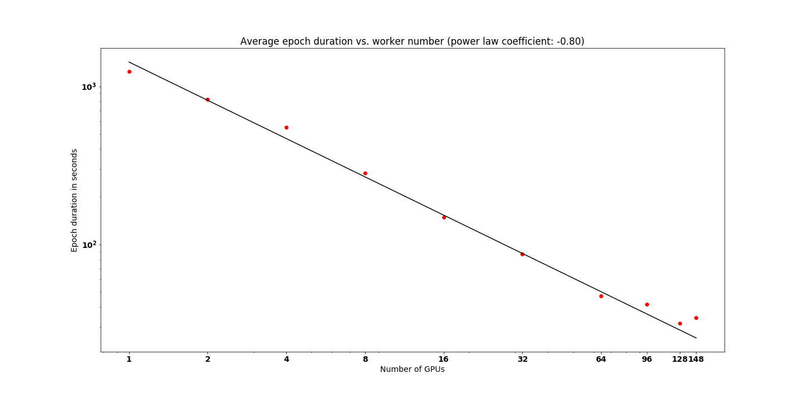

# Scaling up training

If you have completed the [training section](./train.md) of our [tutorial on pixel-level classification](https://github.com/Azure/pixel_level_land_classification), you've trained an image segmentation model for one epoch using two GPUs and eight training image pairs in <20 minutes. For our work with the Chesapeake Conservancy, we trained a similar model for 250 epochs using 148 GPUs and 740 training image pairs -- all in a little over two hours. This section describes how this scaling was achieved and considerations the reader might apply to their own projects.

## Increasing worker (GPU) count

### Decreasing epoch length

Doubling the number of workers would ideally decrease the time required to train the model by half. In practice, the actual speed-up is lower due to overhead in communication between workers and our use of a synchronous training method. We show below that we achieved near-linear speed-ups between 1 and 64 workers, improvements in training time eventually becoming more marginal. (We report the average epoch duration after training data load to memory, a time-intensive step which does not scale with worker number.)



We expect that the following modifications would further improve training time for large clusters (though we did not pursue them for this use case):
- Using workers connected by Infiniband (e.g. the [NC24r Azure VM SKU](https://azure.microsoft.com/en-us/blog/azure-n-series-general-availability-on-december-1/)) to speed up communication between workers
- Using [1-bit Stochastic Gradient Descent](https://docs.microsoft.com/en-us/cognitive-toolkit/enabling-1bit-sgd) to decrease the size of messages passed between workers
- Using [blockwise model update and filtering, aka block momentum](https://docs.microsoft.com/en-us/cognitive-toolkit/Multiple-GPUs-and-machines#6-block-momentum-sgd) during training to decrease the frequency of communication between workers
- Tuning minibatch size to decrease frequency of communication between workers
- Pursuing an asynchronous training approach

### Permitting data load to memory

Increasing worker count is also beneficial when it permits the dataset to be stored entirely in memory. Accessing data from a remote store, or even from disk, can be rate-limiting for training, so it is ideal for each worker to perform an initial data load and then access data from memory in subsequent rounds of training. This becomes achievable using data-parallel training when the number of workers is sufficiently large.

### How to implement

To increase the number of worker nodes in your cluster during deployment, simply modify the "targetNodeCount" and "vmSize" values in the `cluster.json` file. We recommend that you use a [VM SKU](https://docs.microsoft.com/en-us/azure/virtual-machines/linux/overview#vm-sizes) with a larger number of GPUs where possible, e.g. create a cluster with four NC24 VMs rather than a cluster with sixteen NC6 VMs. This option will reduce the average communication time between workers and will not impact the average memory/CPU/storage per worker.

## Data access

### Network File System

At the time that we performed full model training for the Chesapeake Conservancy (9/2017), Azure Batch AI did not yet offer data access from blob storage via blobfuse. Instead, we provisioned a Network File System (NFS) to host our data for concurrent access by many workers. This option is preferable to storing data on an Azure File Share, but we believe that accessing data from blob storage (as demonstrated in this tutorial) will now be preferable for most users.

If you would like to try using an NFS as your data store, you may modify the setup steps in [setup.md](../setup.md) to create a file server and mount it on a new cluster. You may wish to change the username and password for both file server and Batch AI cluster to credentials of your choosing.
```
az batchai file-server create -n batchaidemo -u yourusername -p yourpassword --vm-size Standard_D2_V2 --disk-count 1 --disk-size 1000 --storage-sku Standard_LRS
for /f "delims=" %a in ('az batchai file-server list -g %AZURE_RESOURCE_GROUP% --query "[?name == 'batchaidemo'].mountSettings.fileServerPublicIp | [0]"') do @set AZURE_BATCH_AI_TRAINING_NFS_IP=%a
echo %AZURE_BATCH_AI_TRAINING_NFS_IP%
az batchai cluster create -n batchaidemo -u lcuser -p lcpassword --afs-name batchai --nfs batchaidemo --image UbuntuDSVM --vm-size STANDARD_NC6 --max 2 --min 2 --storage-account-name %STORAGE_ACCOUNT_NAME% --container-name blobfuse --container-mount-path blobfuse -c cluster.json
```
You can then use your favorite SSH or SCP agent to upload your data files under the `/mnt/data` directory of the file server, so that they will be accessible from your cluster. The IP address for your NFS will have been printed to your command prompt by the `echo` command above.

You may also wish to use a premium storage SKU (learn more from the output of `az batchai file-server create -h`), choose [another VM SKU](https://docs.microsoft.com/en-us/azure/virtual-machines/linux/overview#vm-sizes), or increase the disk count/size to improve the performance of your file server.

## Next steps

As you adapt this example to your own needs, you may find the following resources helpful:

### Batch AI resources

- [Batch AI Recipes repository](https://github.com/Azure/BatchAI)

    Demonstrates how to use other deep learning frameworks (e.g. TensorFlow, Caffe, Keras, Chainer) with Batch AI. Also includes examples on how to interact with Batch AI through its SDKs.
- [Batch AI quick-start guide](https://docs.microsoft.com/en-us/azure/batch-ai/quickstart-cli)
- [Batch AI CLI full documentation](https://github.com/Azure/BatchAI/blob/master/documentation/using-azure-cli-20.md)

### CNTK distributed training resources

- [Guide to distributed training with CNTK](https://docs.microsoft.com/en-us/cognitive-toolkit/Multiple-GPUs-and-machines)
- [Example single-GPU vs. distributed training scripts for CNTK](https://github.com/Microsoft/CNTK/tree/master/Examples/Image/Classification/ResNet/Python) -- see also other examples in this repository
- [Guide to developing a UserMinibatchSource for custom data types](https://docs.microsoft.com/en-us/python/api/cntk.io.userminibatchsource?view=cntk-py-2.3)
- [CNTK Python API](https://www.cntk.ai/pythondocs/)

### Training data resources

- [National Agriculture Imagery Program](https://www.fsa.usda.gov/programs-and-services/aerial-photography/imagery-programs/naip-imagery/)

    More information on the aerial imagery used for this project.
- [USDA Geospatial Data Gateway](https://gdg.sc.egov.usda.gov/)
    
    Where you can obtain NAIP data for your region/year of interest.
- [LizardTech's free GeoExpress Command Line applications](https://www.lizardtech.com/gis-tools/tools-and-utilities)

    Can be used to convert from MrSID-formatted NAIP data to TIF format
- [GDAL](http://www.gdal.org/)

    Divide large TIF files so that they can be loaded into memory during training (e.g. using `gdal-translate`).
    
We are not able to redistribute the full 1-meter resolution land use classification dataset created by the [Chesapeake Conservancy](http://chesapeakeconservancy.org/) for the Chesapeake Bay watershed. A few alternative sources of land use data are provided below (though most are not available at 1-meter resolution).

- [National Land Cover Database](https://www.mrlc.gov/finddata.php) (30-meter resolution, country-wide)
- [USGS Gap Analysis Project](https://gapanalysis.usgs.gov/gaplandcover/data/download/) (30-meter resolution, country-wide)
- [NOAA C-CAP FTP site](https://coast.noaa.gov/ccapftp/#/) (30-meter resolution with 1 to 5-meter resolution available in some areas; limited to coastal regions)


Click [here](../README.md) to return to the main page of this repository for more information.
